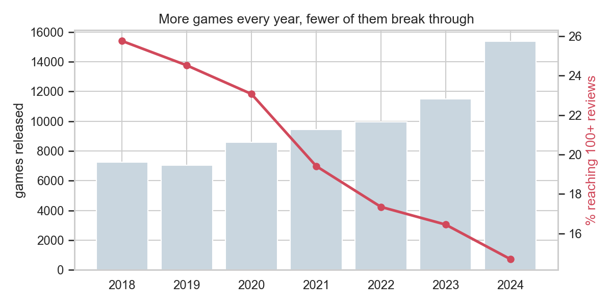
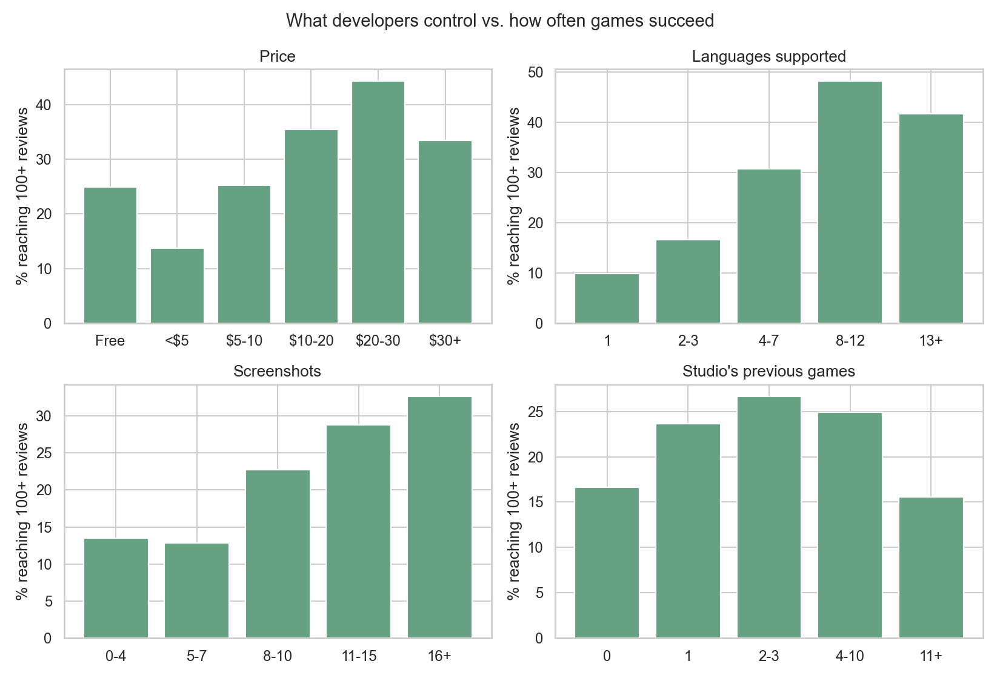

# GameSense: Steam Success Predictor

Predict how a game is likely to perform on Steam using only information available before launch: store page setup, genres, price, platforms, localisation and the studio's track record.

**Live demo:** _add your Streamlit link here_

The app takes a game pitch and returns:

- the most likely outcome tier (Flop / Niche / Success / Hit) with class probabilities
- the probability of reaching 100+ reviews, compared with the average 2024 release
- an estimated review range (10th to 90th percentile)
- per-feature contributions explaining the prediction
- single-change "what-if" scenarios ranked by their effect on the success probability

## Problem

About 15,000 games were released on Steam in 2024, and most of them sold very few copies. Total review count is the most common public proxy for sales, at roughly 30 to 60 copies per review. The target is framed as an ordinal classification into four tiers:

| Tier | Total reviews | Approx. copies sold | Share of dataset |
|---|---|---|---|
| Flop | 0-9 | < 500 | 44% |
| Niche | 10-99 | 500-5k | 37% |
| Success | 100-999 | 5k-50k | 13% |
| Hit | 1,000+ | 50k+ | 6% |

## Data

[Steam Games Dataset](https://huggingface.co/datasets/FronkonGames/steam-games-dataset) by FronkonGames (124,146 apps).

Cleaning steps (`src/prepare_data.py`):

- removed apps with empty store pages, no description, or no SteamSpy tracking
- removed software (utilities, video/audio tools, etc.) and prices above $100
- kept releases from 2018 to 2024 so every game has had at least a year on sale

Result: **69,127 games**.

## Method

### Features (65)

- **Pricing and platforms:** price, free-to-play, Windows/macOS/Linux, mature rating
- **Store page:** screenshots, supported and fully voiced languages, achievements, description length, website
- **Genres and Steam features:** 16 genre flags, 24 category flags (multiplayer modes, controller support, cloud saves, workshop, VR, ...)
- **Studio history:** number of earlier releases by the developer and publisher, best review count among those earlier releases, self-published flag
- **Description text:** TF-IDF (unigrams and bigrams) with Ridge regression on log reviews. Its out-of-fold prediction is stacked as a single feature.

### Leakage controls

- **Time-based split:** train on 2018-2022, validate on 2023, test on 2024.
- **Excluded post-launch signals:** user tags, DLC count, playtime, Metacritic score, Steam Trading Cards (granted by Valve based on sales) and Family Sharing (added to most games after launch).
- **Description cleaning:** wording that is usually added after release (awards, sales figures, "Deluxe Edition", patch notes) is removed before vectorising.
- **Chronological studio history:** it only counts games released before the game being scored.

### Models

1. **Baselines:** majority class, logistic regression, random forest.
2. **Gradient boosting:** XGBoost and LightGBM, each tuned with Optuna (40 trials, validation log loss).
3. **Final classifier:** an equal-weight probability blend of the two boosted models. The blend weight was selected on the 2023 validation set.
4. **Review range:** three LightGBM quantile regressors (10th, 50th, 90th percentiles) on log reviews. The median model also provides the per-feature contributions shown in the app.

## Results

All scores are on the **2024 test set (15,361 games)**, which was not used for training or tuning.

| Model | Accuracy | Macro F1 | Quadratic κ | Within 1 tier | ROC-AUC (macro) | AUC: 100+ reviews |
|---|---|---|---|---|---|---|
| Majority class | 0.556 | 0.179 | 0.000 | 0.853 | 0.500 | 0.500 |
| Logistic Regression | 0.639 | 0.528 | 0.598 | 0.956 | 0.821 | 0.878 |
| Random Forest | 0.654 | 0.567 | 0.649 | 0.969 | 0.841 | 0.891 |
| XGBoost (tuned) | 0.666 | 0.578 | 0.663 | 0.968 | 0.851 | 0.900 |
| LightGBM (tuned) | 0.665 | 0.576 | 0.659 | 0.966 | 0.850 | 0.899 |
| **GameSense ensemble** | **0.666** | **0.577** | **0.663** | **0.968** | **0.851** | **0.900** |

Review-count regression on the same test set:

- the median estimate is within 3x of the actual count for 61% of games
- Spearman ρ = 0.68
- the 10th-90th percentile interval contains the actual count for 71% of games

The full metrics are in `models/metrics.json` and `reports/model_comparison_test2024.csv`.

## Findings from the data





- The number of releases doubled between 2018 and 2024, while the share of games reaching 100 reviews fell from 26% to 15%.
- Games supporting 8-12 languages reach 100+ reviews about five times as often as English-only games.
- Store pages with 11+ screenshots perform noticeably better than pages with fewer than 8.
- A studio's second to fourth release does better than its first. Very prolific studios (11+ releases) do worse, which is mostly asset-flip and shovelware catalogues.

## Project structure

```
├── app/
│   ├── streamlit_app.py        entry point
│   ├── common.py               cached loaders
│   ├── presets.py              example games
│   ├── data/insights.parquet   reduced dataset for the insights page
│   └── views/                  predict, insights, how_it_works
├── src/
│   ├── config.py               paths, splits, tiers, feature vocabularies
│   ├── prepare_data.py         cleaning and studio history
│   ├── features.py             feature engineering and text model
│   ├── eda.py                  figures and app dataset
│   ├── experiments.py          baseline comparison
│   ├── tune.py                 Optuna search
│   ├── train.py                final training, evaluation, export
│   ├── metrics.py
│   └── predictor.py            inference, explanations, what-if
├── models/                     gamesense.joblib, best_params.json, metrics.json
├── reports/                    figures and comparison tables
├── requirements.txt            app dependencies
├── requirements-dev.txt        training dependencies
└── packages.txt                system packages for Streamlit Community Cloud
```

## Running locally

```bash
pip install -r requirements.txt
streamlit run app/streamlit_app.py
```

## Reproducing the model

```bash
pip install -r requirements-dev.txt
```

Download the dataset (about 190 MB) to `data/raw/steam_games.parquet`:

```bash
curl -L -o data/raw/steam_games.parquet https://huggingface.co/api/datasets/FronkonGames/steam-games-dataset/parquet/default/train/0.parquet
```

Then run the pipeline:

```bash
python -m src.prepare_data
python -m src.eda
python -m src.experiments
python -m src.tune --trials 40
python -m src.train
```

On a laptop CPU, tuning takes about an hour and training about 11 minutes.

## Limitations

- **Reviews measure reach, not revenue or quality.** A $3 game and a $30 game with the same review count earned very different amounts.
- **Only store-page data is used.** Wishlists, trailers, marketing, press and streamer coverage are not in the data, and they are often the deciding factors.
- **Store pages change after launch.** Languages, screenshots and achievements may have been added later, so these signals are somewhat optimistic.
- **Studio history is measured at the snapshot date,** not at the time of each launch.
- **Associations are not causal.** The what-if scenarios show how the model responds, not guaranteed outcomes.
